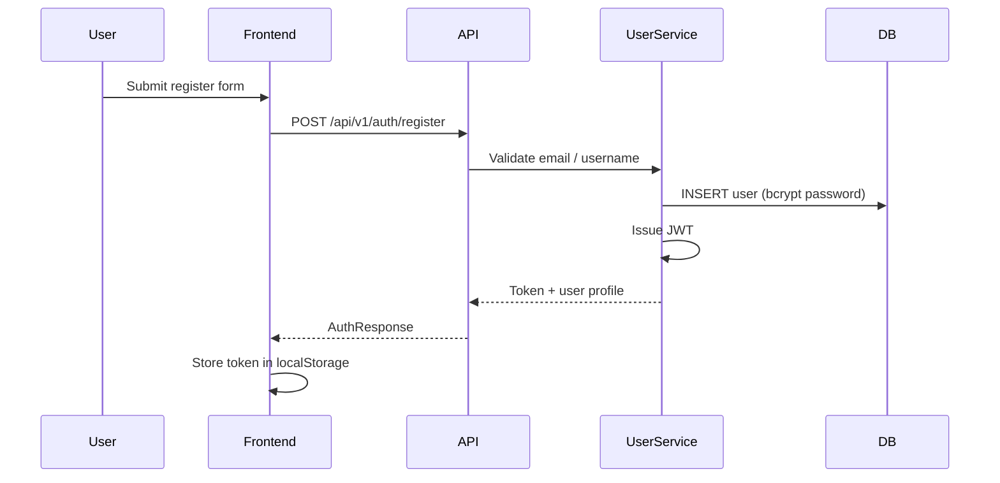
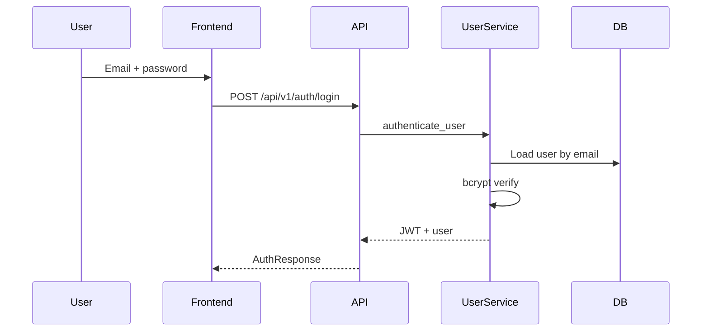
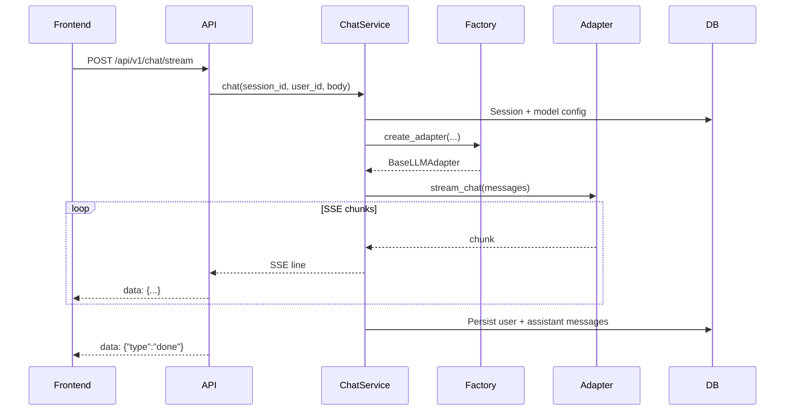

# My AI Studio — Backend Architecture

## Overview

**My AI Studio** is a unified LLM gateway platform. It supports multiple providers, streaming chat, batch jobs, multimodal uploads, and per-user model configuration with bring-your-own-key (BYOK) API keys.

### Core features

- **Multi-provider adapters** — DeepSeek, Qwen, OpenAI, Gemini, OpenRouter, Ollama, vLLM, and optional OMP (local OpenAI-compatible gateway)
- **Four adapter families** — `official` (vendor APIs), `openrouter`, `ollama`, `vllm`, plus `omp` for `~/.omp` configs
- **Streaming** — Server-Sent Events (SSE) for real-time output
- **Batch jobs** — Bulk inference workflows (Celery integration planned)
- **Multimodal inputs** — Images and files via upload APIs
- **Auth** — Registration, login, JWT
- **Sessions** — Persistent chat history and per-session settings

---

## Tech stack

### Backend

| Layer | Technology |
|--------|------------|
| Web framework | FastAPI (async) |
| ORM | SQLAlchemy 2.0 |
| Database | SQLite + `aiosqlite` |
| ASGI server | Uvicorn |

### Security

| Concern | Technology |
|---------|------------|
| Auth tokens | `python-jose` (JWT, HS256) |
| Passwords | bcrypt |
| User API keys at rest | Fernet (`cryptography`), key from env or `backend/.encryption_key` |

### Observability & config

- **structlog** — structured logging
- **Pydantic Settings** — `.env` + environment variables

### Planned (Phase 6)

- **Celery** + **Redis** — background batch execution

---

## Project layout

```
backend/
├── app/
│   ├── api/
│   │   ├── v1/
│   │   │   ├── auth.py              # Register, login, me
│   │   │   ├── chat.py              # Stream / complete chat
│   │   │   ├── sessions.py          # Sessions & messages
│   │   │   ├── models.py            # User model configs (BYOK)
│   │   │   ├── models_info.py       # Adapter / provider metadata
│   │   │   ├── omp.py               # Optional ~/.omp catalog
│   │   │   ├── system_instructions.py
│   │   │   ├── files.py
│   │   │   ├── batch.py
│   │   │   └── health.py
│   │   └── middleware.py            # CORS, request logging
│   ├── core/
│   │   ├── adapters/                # LLM adapter layer
│   │   ├── exceptions.py
│   │   ├── streaming.py
│   │   └── retry.py
│   ├── models/
│   │   ├── database.py              # SQLAlchemy models
│   │   └── schemas.py               # Pydantic DTOs
│   ├── services/                    # Business logic
│   ├── db/
│   ├── utils/
│   ├── config.py
│   ├── dependencies.py
│   └── main.py
├── config/providers.yaml            # Provider metadata (env var names only)
├── storage/uploads/
├── tests/
├── .env.example
└── run.py
```

---

## Data model

### User

| Field | Description |
|-------|-------------|
| `id` | UUID primary key |
| `email` | Unique login email |
| `username` | Unique display name |
| `hashed_password` | bcrypt hash |
| `is_active` | Account flag |
| `created_at` / `updated_at` | Timestamps |

### Session

| Field | Description |
|-------|-------------|
| `id` | UUID |
| `user_id` | FK → `users` |
| `title`, `description` | Metadata |
| `is_archived` | Archive flag |

### Message

| Field | Description |
|-------|-------------|
| `session_id` | FK → `sessions` |
| `role` | `user` \| `assistant` \| `system` |
| `content` | Message body |
| `thinking_content` | Reasoning trace (reasoning models) |
| `tokens_used`, `model_used`, `provider_used` | Usage metadata |
| `tool_calls` | JSON tool-call payload |

### SessionConfig

Per-session overrides: `model_config_id`, inline `model_id`, `adapter_type`, `provider`, sampling params, `system_prompt`.

### ModelConfig (BYOK)

| Field | Description |
|-------|-------------|
| `user_id` | Owner |
| `adapter_type` | `official` \| `openrouter` \| `ollama` \| `vllm` \| `omp` |
| `provider` | Vendor id when `official` |
| `model_id` | Model id sent to the upstream API |
| `base_url` | Optional override |
| `encrypted_api_key` | Fernet-encrypted key (never returned in API responses) |
| `is_default` / `is_active` | Selection flags |

### File, BatchJob, BatchItem

Files store upload metadata and paths under `storage/uploads`. Batch tables track job status, per-item I/O JSON, retries, and errors.

---

## Authentication

### Registration



**Code:** [`backend/app/api/v1/auth.py`](../../backend/app/api/v1/auth.py)

### Login



### JWT

| Setting | Value |
|---------|--------|
| Algorithm | HS256 |
| TTL | 7 days (configurable via settings) |
| Payload | `sub` = user id, `exp` = expiry |
| Header | `Authorization: Bearer <token>` |

**Code:** [`backend/app/services/user_service.py`](../../backend/app/services/user_service.py)

---

## Chat & streaming

### Stream flow



### SSE payload shape

```
data: {"type": "content", "content": "Hello", "delta": "Hello"}
data: {"type": "usage", "usage": {"input_tokens": 10, "output_tokens": 5}}
data: {"type": "done"}
```

**Code:**

- [`backend/app/api/v1/chat.py`](../../backend/app/api/v1/chat.py)
- [`backend/app/services/chat_service.py`](../../backend/app/services/chat_service.py)
- [`backend/app/core/streaming.py`](../../backend/app/core/streaming.py)

---

## Adapter layer

### Adapter types

| Type | Purpose |
|------|---------|
| **official** | Direct vendor APIs (DeepSeek, Qwen, OpenAI, Gemini, …) |
| **openrouter** | OpenRouter unified gateway |
| **ollama** | Local Ollama (`/v1` compatible) |
| **vllm** | Local vLLM OpenAI-compatible server |
| **omp** | Reads matching keys from `~/.omp/agent/models.yml` when base URL aligns |

Provider metadata (base URLs, model lists, **env var names only**) lives in [`backend/config/providers.yaml`](../../backend/config/providers.yaml). **Secrets are not stored in the repo** — users enter keys in the UI or set environment variables on the server.

### Factory

[`backend/app/core/adapters/factory.py`](../../backend/app/core/adapters/factory.py) selects the concrete adapter from `adapter_type`, `provider`, `model_id`, decrypted API key, and `base_url`.

---

## Application bootstrap

[`backend/app/main.py`](../../backend/app/main.py):

1. Lifespan: log startup / shutdown, close DB pool
2. FastAPI app + OpenAPI tags
3. CORS + logging middleware
4. Global handlers for `LLMException` and validation errors
5. Mount `api_router` under `/api`

### Run locally

```bash
cd backend
cp .env.example .env   # set SECRET_KEY and optional encryption key
pip install -r requirements.txt
python run.py
# Default: http://0.0.0.0:10011
```

### Example `.env`

```ini
APP_NAME=My AI Studio
ENVIRONMENT=development
DEBUG=true
HOST=0.0.0.0
PORT=10011
DATABASE_URL=sqlite+aiosqlite:///./myai_studio.db
SECRET_KEY=change-me-in-production
API_KEY_ENCRYPTION_KEY=your-fernet-key-or-use-generated-.encryption_key
CORS_ORIGINS=http://localhost:5173,http://127.0.0.1:5173
LOG_LEVEL=INFO
```

---

## API surface (summary)

Base path: `/api/v1` unless noted.

### Auth

| Method | Path | Description |
|--------|------|-------------|
| POST | `/auth/register` | Register |
| POST | `/auth/login` | Login |
| GET | `/auth/me` | Current user |

### Sessions

| Method | Path | Description |
|--------|------|-------------|
| POST | `/sessions` | Create |
| GET | `/sessions` | List (paginated) |
| GET/PATCH/DELETE | `/sessions/{id}` | CRUD |
| GET/PATCH | `/sessions/{id}/config` | Session config |
| GET | `/sessions/{id}/messages` | Message history |

### Chat

| Method | Path | Description |
|--------|------|-------------|
| POST | `/chat/stream` | SSE stream |
| POST | `/chat/complete` | Non-streaming |
| GET | `/chat/history/{session_id}` | History alias |

### Model configs (BYOK)

| Method | Path | Description |
|--------|------|-------------|
| POST/GET/PATCH/DELETE | `/models`, `/models/{id}` | CRUD |
| POST | `/models/{id}/validate` | Test connection |
| GET | `/models/{id}/available` | List models from provider |
| GET | `/models/adapter-types` | Adapter metadata |

### System instructions

| Method | Path | Description |
|--------|------|-------------|
| GET/POST | `/system-instructions` | List / create |
| GET/PATCH/DELETE | `/system-instructions/{id}` | CRUD |
| POST | `/system-instructions/{id}/use` | Mark as used |

### Files, batch, health, OMP

- **Files** — upload, list, download, delete
- **Batch** — create job, status, cancel, list items
- **Health** — `/health`, `/health/ready`
- **OMP** — `GET /models/omp/catalog` (optional local catalog; does not expose raw API keys)

---

## Cross-cutting concerns

### Dependency injection

[`backend/app/dependencies.py`](../../backend/app/dependencies.py) provides `get_db`, `get_current_user_auth`, and service factories (`ChatService`, `ModelService`, etc.) via FastAPI `Depends`.

### Errors

[`backend/app/core/exceptions.py`](../../backend/app/core/exceptions.py) defines `LLMException` and typed errors (`RateLimitError`, `ConfigurationError`, …) mapped to HTTP responses in middleware.

### Retries

[`backend/app/core/retry.py`](../../backend/app/core/retry.py) wraps upstream calls with exponential backoff where appropriate.

### API key encryption

User-supplied keys are encrypted with Fernet before persistence in `model_configs.encrypted_api_key`. See [`backend/app/services/model_service.py`](../../backend/app/services/model_service.py) and [SECURITY.md](../../SECURITY.md).

---

## Quick start (API)

### Register

```bash
curl -X POST http://localhost:10011/api/v1/auth/register \
  -H "Content-Type: application/json" \
  -d '{"email":"user@example.com","username":"demo","password":"your-password"}'
```

### Create a model config

```bash
curl -X POST http://localhost:10011/api/v1/models \
  -H "Authorization: Bearer <token>" \
  -H "Content-Type: application/json" \
  -d '{
    "name": "DeepSeek",
    "adapter_type": "official",
    "provider": "deepseek",
    "model_id": "deepseek-chat",
    "api_key": "sk-your-key",
    "is_default": true
  }'
```

### Stream chat

```bash
curl -N -X POST http://localhost:10011/api/v1/chat/stream \
  -H "Authorization: Bearer <token>" \
  -H "Content-Type: application/json" \
  -d '{"session_id":"<uuid>","message":"Hello","stream":true}'
```

---

## Code index

| Area | Path |
|------|------|
| App entry | [`backend/app/main.py`](../../backend/app/main.py) |
| Settings | [`backend/app/config.py`](../../backend/app/config.py) |
| Dependencies | [`backend/app/dependencies.py`](../../backend/app/dependencies.py) |
| ORM models | [`backend/app/models/database.py`](../../backend/app/models/database.py) |
| Schemas | [`backend/app/models/schemas.py`](../../backend/app/models/schemas.py) |
| Auth API | [`backend/app/api/v1/auth.py`](../../backend/app/api/v1/auth.py) |
| Chat API | [`backend/app/api/v1/chat.py`](../../backend/app/api/v1/chat.py) |
| Models API | [`backend/app/api/v1/models.py`](../../backend/app/api/v1/models.py) |
| Chat service | [`backend/app/services/chat_service.py`](../../backend/app/services/chat_service.py) |
| Model service | [`backend/app/services/model_service.py`](../../backend/app/services/model_service.py) |
| Adapter factory | [`backend/app/core/adapters/factory.py`](../../backend/app/core/adapters/factory.py) |

---

## Design notes

1. **Clear layers** — API → Service → Adapter / ORM  
2. **Adapter pattern** — One chat pipeline, many providers  
3. **Async-first** — SQLAlchemy async sessions and streaming responses  
4. **Security** — JWT for users; Fernet for provider keys at rest  
5. **BYOK** — No vendor keys in source control; keys per user in the database  

### Status

| Phase | State |
|-------|--------|
| Phases 1–5 | Implemented (auth, chat, sessions, models, files, batch API) |
| Phase 6 | Celery / Redis execution (in progress) |

---

**Document version:** 1.1  
**Last updated:** 2026-06-03  
**Language:** English (replaces the former Chinese architecture doc)
