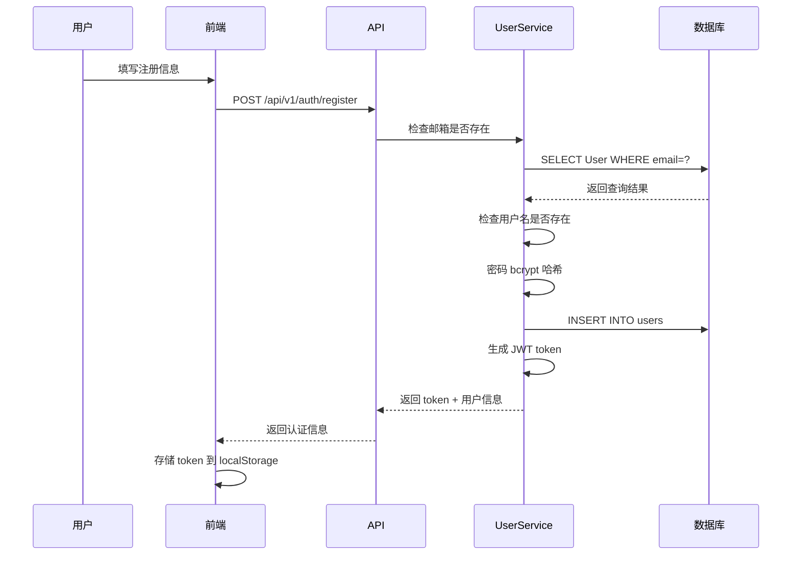
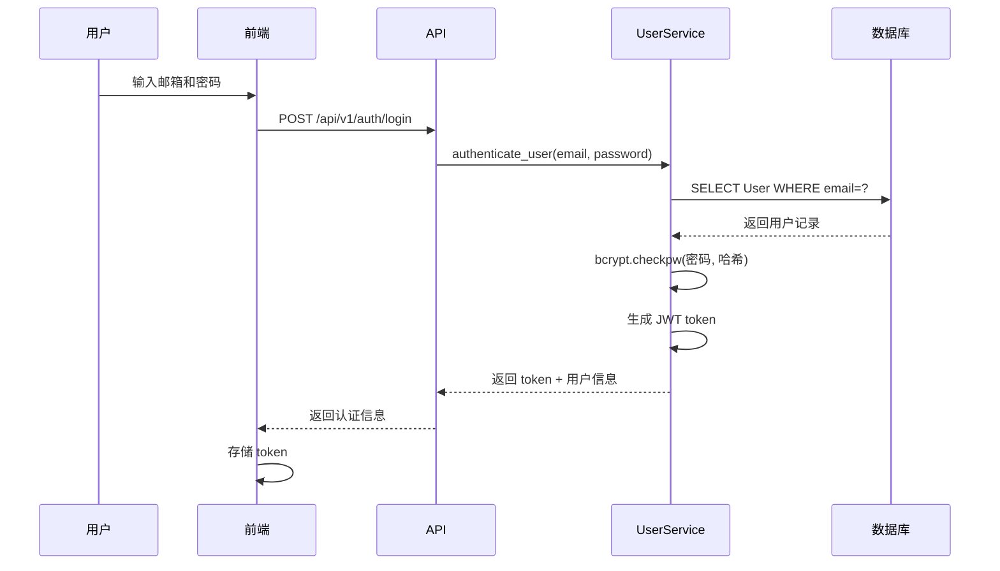
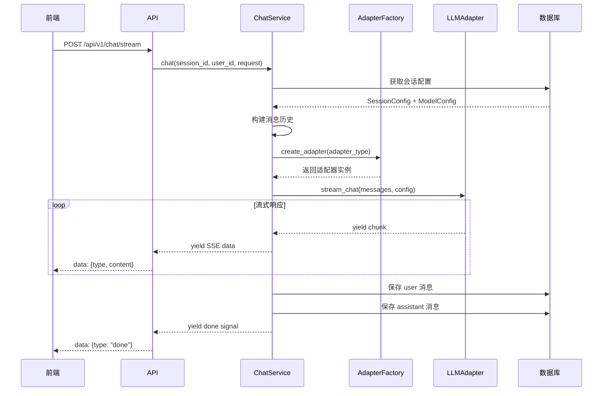

# 我的 AI Studio 后端架构分析

## 📋 项目概述

**我的 AI Studio** 是一个通用大模型接入平台，支持多种 LLM 模型的统一接入、流式响应、批处理任务等功能。

### 核心特性
- 🤖 **多模型适配** - 支持 DeepSeek、Qwen、OpenRouter、Ollama、vLLM 等多种模型
- 🔄 **四类适配器架构** - OFFICIAL (官方直连)、OPENROUTER (统一网关)、OLLAMA (本地部署)、VLLM (高性能推理)
- 💬 **流式响应** - 基于 SSE (Server-Sent Events) 的实时流式输出
- 📦 **批处理任务** - 支持大规模批量推理
- 🎯 **多模态支持** - 图片、视频、音频、文档输入
- 👤 **用户管理** - 注册、登录、JWT 认证
- 💾 **会话管理** - 会话历史保存与读取

---

## 🛠️ 技术栈

### 后端框架
- **FastAPI** - 高性能异步 Web 框架
- **SQLAlchemy 2.0** - ORM 与数据库抽象层
- **SQLite** + `aiosqlite` - 轻量级异步数据库
- **Uvicorn** - ASGI 服务器

### 认证与安全
- **python-jose** - JWT token 生成与验证
- **bcrypt** - 密码哈希
- **cryptography** - API Key 加密存储

### 日志与监控
- **structlog** - 结构化日志
- **Pydantic Settings** - 配置管理

### 异步任务（Phase 6，进行中）
- **Celery** - 分布式任务队列
- **Redis** - 消息代理

---

## 🏗️ 项目架构

### 目录结构
```
backend/
├── app/
│   ├── api/               # API 层
│   │   ├── v1/            # API v1 端点
│   │   │   ├── auth.py         # 认证（注册、登录）
│   │   │   ├── chat.py         # 聊天（流式/非流式）
│   │   │   ├── sessions.py     # 会话管理
│   │   │   ├── models.py       # 模型配置管理
│   │   │   ├── files.py        # 文件上传下载
│   │   │   ├── batch.py        # 批处理任务
│   │   │   └── health.py       # 健康检查
│   │   └── middleware.py  # CORS、日志中间件
│   │
│   ├── core/              # 核心逻辑
│   │   ├── adapters/      # LLM 适配器
│   │   │   ├── base.py         # 基础适配器抽象类
│   │   │   ├── factory.py      # 适配器工厂
│   │   │   ├── official/       # 官方模型（DeepSeek、Qwen）
│   │   │   ├── openrouter/     # OpenRouter 网关
│   │   │   ├── ollama/         # Ollama 本地部署
│   │   │   └── vllm/           # vLLM 高性能推理
│   │   ├── exceptions.py  # 自定义异常
│   │   ├── streaming.py   # 流式响应处理
│   │   └── retry.py       # 重试机制
│   │
│   ├── models/            # 数据层
│   │   ├── database.py    # SQLAlchemy ORM 模型
│   │   └── schemas.py     # Pydantic 请求/响应模型
│   │
│   ├── services/          # 业务服务层
│   │   ├── user_service.py      # 用户服务
│   │   ├── session_service.py   # 会话服务
│   │   ├── chat_service.py      # 聊天服务
│   │   ├── model_service.py     # 模型配置服务
│   │   ├── file_service.py      # 文件服务
│   │   └── batch_service.py     # 批处理服务
│   │
│   ├── db/                # 数据库配置
│   │   └── database.py    # 数据库引擎与会话
│   │
│   ├── utils/             # 工具函数
│   │   └── logging.py     # 日志配置
│   │
│   ├── config.py          # 配置管理
│   ├── dependencies.py    # 依赖注入
│   └── main.py            # FastAPI 应用入口
│
├── storage/               # 文件存储目录
├── tests/                 # 测试文件
├── .env                   # 环境变量配置
└── run.py                 # 启动脚本
```

---

## 🗄️ 数据模型详解

### 核心表结构

#### 1. **User** - 用户表
```python
- id: UUID (主键)
- email: 邮箱 (唯一)
- username: 用户名 (唯一)
- hashed_password: 密码哈希 (bcrypt)
- is_active: 是否激活
- created_at / updated_at: 时间戳
```

#### 2. **Session** - 会话表
```python
- id: UUID (主键)
- user_id: 用户 ID (外键 → users.id)
- title: 会话标题
- description: 会话描述
- is_archived: 是否归档
- created_at / updated_at: 时间戳
```

#### 3. **Message** - 消息表
```python
- id: UUID (主键)
- session_id: 会话 ID (外键 → sessions.id)
- role: 消息角色 (user | assistant | system)
- content: 消息内容
- thinking_content: 推理内容（用于推理模型）
- tokens_used: Token 使用量
- model_used: 使用的模型
- provider_used: 使用的提供商
- tool_calls: 工具调用记录 (JSON)
- created_at: 创建时间
```

#### 4. **SessionConfig** - 会话配置表
```python
- id: UUID (主键)
- session_id: 会话 ID (外键，唯一)
- model_config_id: 模型配置 ID (外键 → model_configs.id，可选)
- model_id: 模型 ID (内联配置)
- adapter_type: 适配器类型
- provider: 提供商
- temperature: 温度参数 (0-100)
- max_tokens: 最大 token 数
- top_p: Top-p 采样
- system_prompt: 系统提示词
```

#### 5. **ModelConfig** - 模型配置表
```python
- id: UUID (主键)
- user_id: 用户 ID (外键 → users.id)
- name: 配置名称
- adapter_type: 适配器类型 (official | openrouter | ollama | vllm)
- provider: 提供商 (仅 official 需要)
- model_id: 模型 ID
- base_url: 基础 URL (可选)
- encrypted_api_key: 加密的 API Key
- is_default: 是否为默认配置
- is_active: 是否激活
- created_at / updated_at: 时间戳
```

#### 6. **File** - 文件表
```python
- id: UUID (主键)
- user_id: 用户 ID (外键 → users.id)
- name: 文件名
- type: 文件类型 (image | video | audio | document)
- mime_type: MIME 类型
- size: 文件大小
- storage_path: 存储路径
- url: 访问 URL
- file_metadata: 元数据 (JSON)
- created_at: 创建时间
```

#### 7. **BatchJob** & **BatchItem** - 批处理任务表
```python
BatchJob:
- id: UUID
- user_id: 用户 ID
- name: 任务名称
- status: 状态 (pending | running | completed | failed | cancelled)
- total_items / processed_items / failed_items: 统计
- created_at / started_at / completed_at: 时间戳

BatchItem:
- id: UUID
- batch_job_id: 批处理任务 ID
- input_data: 输入数据 (JSON)
- output_data: 输出数据 (JSON)
- status: 状态
- error_message: 错误信息
- retry_count: 重试次数
```

---

## 🔐 用户认证流程

### 注册流程


**关键代码位置**: [`app/api/v1/auth.py`](file:///home/MuYuWorkSpace/04_my-ai-studio/backend/app/api/v1/auth.py#L23-L72)

### 登录流程


**关键代码位置**: [`app/api/v1/auth.py`](file:///home/MuYuWorkSpace/04_my-ai-studio/backend/app/api/v1/auth.py#L75-L113)

### JWT 认证机制
- **算法**: HS256
- **过期时间**: 7 天
- **Token 结构**: `{"sub": user_id, "exp": expire_timestamp}`
- **验证方式**: HTTP Bearer Token (`Authorization: Bearer <token>`)

**实现位置**: [`app/services/user_service.py`](file:///home/MuYuWorkSpace/04_my-ai-studio/backend/app/services/user_service.py)

---

## 💬 聊天实现机制

### 流式聊天流程


### SSE (Server-Sent Events) 格式
```
data: {"type": "content", "content": "你好", "delta": "你"}
data: {"type": "content", "content": "你好，世", "delta": "，世"}
data: {"type": "content", "content": "你好，世界", "delta": "界"}
data: {"type": "usage", "usage": {"input_tokens": 10, "output_tokens": 5}}
data: {"type": "done"}
```

**实现位置**: 
- API 端点: [`app/api/v1/chat.py`](file:///home/MuYuWorkSpace/04_my-ai-studio/backend/app/api/v1/chat.py)
- 服务逻辑: [`app/services/chat_service.py`](file:///home/MuYuWorkSpace/04_my-ai-studio/backend/app/services/chat_service.py)

---

## 🔌 适配器架构设计

### 适配器类型

#### 1. **OFFICIAL** - 官方直连
支持的提供商：
- **DeepSeek** (`deepseek`): deepseek-chat, deepseek-reasoner
- **Qwen** (`qwen`): qwen-plus, qwen3-plus, qwen-vl-plus
- **OpenAI** (`openai`): gpt-4, gpt-3.5-turbo
- **Anthropic** (`anthropic`): claude-3-opus
- **Gemini** (`gemini`): gemini-pro

#### 2. **OPENROUTER** - 统一网关
通过 OpenRouter API 访问多种模型。

#### 3. **OLLAMA** - 本地部署
连接本地 Ollama 服务，支持开源模型。

#### 4. **VLLM** - 高性能推理
连接 vLLM 推理引擎。

### 适配器工厂模式
```python
# app/core/adapters/factory.py
def create_adapter(adapter_config: AdapterConfig) -> BaseLLMAdapter:
    adapter_type = adapter_config.adapter_type.lower()
    
    if adapter_type == "official":
        provider = adapter_config.provider
        if provider == "deepseek":
            return DeepSeekAdapter(adapter_config)
        elif provider == "qwen":
            return QwenAdapter(adapter_config)
        # ...
    
    elif adapter_type == "openrouter":
        return OpenRouterAdapter(adapter_config)
    
    elif adapter_type == "ollama":
        return OllamaAdapter(adapter_config)
    
    elif adapter_type == "vllm":
        return VLLMAdapter(adapter_config)
```

**实现位置**: [`app/core/adapters/factory.py`](file:///home/MuYuWorkSpace/04_my-ai-studio/backend/app/core/adapters/factory.py)

---

## 🚀 启动流程

### 应用初始化 ([`app/main.py`](file:///home/MuYuWorkSpace/04_my-ai-studio/backend/app/main.py))

```python
@asynccontextmanager
async def lifespan(app: FastAPI):
    # 启动时
    logger.info("Starting application")
    # 数据库由 Alembic 管理，无需自动建表
    yield
    # 关闭时
    await close_db()
    logger.info("Shutting down application")

app = FastAPI(
    title="MyAI Studio API",
    version=settings.APP_VERSION,
    lifespan=lifespan,
)

# 配置中间件
configure_cors(app)  # CORS 支持
configure_logging_middleware(app)  # 请求日志

# 注册异常处理器
app.add_exception_handler(LLMException, llm_exception_handler)
app.add_exception_handler(RequestValidationError, validation_exception_handler)

# 注册路由
app.include_router(api_router, prefix="/api")
```

### 启动脚本 (`run.py`)
```bash
# 开发环境
python run.py

# 等同于
uvicorn app.main:app --host 0.0.0.0 --port 10010 --reload
```

### 环境变量配置 (`.env`)
```ini
# 应用配置
APP_NAME=MyAI Studio
ENVIRONMENT=development
DEBUG=True

# 服务器
HOST=0.0.0.0
PORT=10010

# 数据库
DATABASE_URL=sqlite+aiosqlite:///./myai_studio.db

# 安全
SECRET_KEY=your-secret-key-here
API_KEY_ENCRYPTION_KEY=your-32-byte-encryption-key-here

# CORS
CORS_ORIGINS=http://localhost:3000,http://localhost:5173

# 日志
LOG_LEVEL=INFO
LOG_FORMAT=json
```

---

## 📡 完整 API 端点列表

### 认证相关
- `POST /api/v1/auth/register` - 用户注册
- `POST /api/v1/auth/login` - 用户登录
- `GET /api/v1/auth/me` - 获取当前用户信息

### 会话管理
- `POST /api/v1/sessions` - 创建会话
- `GET /api/v1/sessions` - 列出会话
- `GET /api/v1/sessions/{id}` - 获取会话详情
- `PATCH /api/v1/sessions/{id}` - 更新会话
- `DELETE /api/v1/sessions/{id}` - 删除会话
- `GET /api/v1/sessions/{id}/config` - 获取会话配置
- `PATCH /api/v1/sessions/{id}/config` - 更新会话配置

### 聊天接口
- `POST /api/v1/chat/stream` - 流式聊天 (SSE)
- `POST /api/v1/chat/complete` - 非流式聊天
- `GET /api/v1/chat/history/{id}` - 获取聊天历史

### 模型配置
- `GET /api/v1/models/adapter-types` - 获取适配器类型
- `POST /api/v1/models` - 创建模型配置
- `GET /api/v1/models` - 列出模型配置
- `GET /api/v1/models/{id}` - 获取模型配置
- `PATCH /api/v1/models/{id}` - 更新模型配置
- `DELETE /api/v1/models/{id}` - 删除模型配置

### 文件管理
- `POST /api/v1/files/upload` - 上传文件
- `GET /api/v1/files` - 列出文件
- `GET /api/v1/files/{id}` - 获取文件信息
- `GET /api/v1/files/{id}/download` - 下载文件
- `DELETE /api/v1/files/{id}` - 删除文件

### 批处理任务
- `POST /api/v1/batch` - 创建批处理任务
- `GET /api/v1/batch` - 列出批处理任务
- `GET /api/v1/batch/{id}` - 获取批处理任务
- `GET /api/v1/batch/{id}/status` - 获取批处理进度
- `POST /api/v1/batch/{id}/cancel` - 取消批处理任务

**总计 31 个 API 端点已实现** ✅

---

## 🔑 核心功能实现要点

### 1. 依赖注入系统
通过 FastAPI 的 `Depends` 实现服务层的依赖注入：

```python
# app/dependencies.py
async def get_current_user_auth(
    credentials: HTTPAuthorizationCredentials = Depends(security),
) -> UUID:
    token = credentials.credentials
    user_id = UserService.decode_access_token(token)
    if not user_id:
        raise HTTPException(status_code=401, detail="无效的认证凭据")
    return UUID(user_id)

async def get_chat_service(db: AsyncSession = Depends(get_db)) -> ChatService:
    return ChatService(db)
```

### 2. 异常处理
统一的异常处理机制：

```python
# app/core/exceptions.py
class LLMException(Exception):
    """LLM 相关异常基类"""
    def __init__(self, error_code: str, message: str, details: dict = None):
        self.error_code = error_code
        self.message = message
        self.details = details or {}

class RateLimitError(LLMException):
    """速率限制异常"""

class ConfigurationError(LLMException):
    """配置错误异常"""
```

### 3. 重试机制
对 LLM 调用实现自动重试：

```python
# app/core/retry.py
@retry(
    stop=stop_after_attempt(3),
    wait=wait_exponential(multiplier=1, min=2, max=10),
    retry=retry_if_exception_type(RateLimitError)
)
async def call_llm_with_retry(...):
    ...
```

### 4. API Key 加密存储
使用 Fernet 对称加密保护 API Key：

```python
from cryptography.fernet import Fernet

# 加密
cipher = Fernet(settings.API_KEY_ENCRYPTION_KEY.encode())
encrypted_key = cipher.encrypt(api_key.encode()).decode()

# 解密
decrypted_key = cipher.decrypt(encrypted_key.encode()).decode()
```

---

## 🎓 使用指南

### 初次使用 - 注册账号

#### 方式 1: 通过前端界面注册（推荐）
1. 访问 `http://localhost:3000` 或 `http://<your-ip>:3000`
2. 点击 **注册** 按钮
3. 填写以下信息：
   - **邮箱**: 用于登录的唯一标识
   - **用户名**: 显示名称
   - **密码**: 至少 6 位
4. 提交后自动登录，获得 JWT Token

#### 方式 2: 通过 API 直接注册
```bash
curl -X POST http://localhost:10010/api/v1/auth/register \
  -H "Content-Type: application/json" \
  -d '{
    "email": "user@example.com",
    "username": "testuser",
    "password": "your-password"
  }'
```

**响应示例**:
```json
{
  "access_token": "eyJhbGciOiJIUzI1NiIsInR5cCI6IkpXVCJ9...",
  "token_type": "bearer",
  "user": {
    "id": "uuid-here",
    "email": "user@example.com",
    "username": "testuser",
    "is_active": true,
    "created_at": "2024-01-01T00:00:00Z"
  }
}
```

### 登录
```bash
curl -X POST http://localhost:10010/api/v1/auth/login \
  -H "Content-Type: application/json" \
  -d '{
    "email": "user@example.com",
    "password": "your-password"
  }'
```

### 创建会话并聊天
```bash
# 1. 创建会话
curl -X POST http://localhost:10010/api/v1/sessions \
  -H "Authorization: Bearer <your-token>" \
  -H "Content-Type: application/json" \
  -d '{"title": "测试会话"}'

# 2. 流式聊天
curl -X POST http://localhost:10010/api/v1/chat/stream \
  -H "Authorization: Bearer <your-token>" \
  -H "Content-Type: application/json" \
  -d '{
    "session_id": "<session-id>",
    "message": "你好，介绍一下你自己",
    "stream": true
  }'
```

---

## 🔍 代码关键位置索引

| 功能模块 | 文件路径 |
|---------|---------|
| **应用入口** | [app/main.py](file:///home/MuYuWorkSpace/04_my-ai-studio/backend/app/main.py) |
| **配置管理** | [app/config.py](file:///home/MuYuWorkSpace/04_my-ai-studio/backend/app/config.py) |
| **依赖注入** | [app/dependencies.py](file:///home/MuYuWorkSpace/04_my-ai-studio/backend/app/dependencies.py) |
| **数据模型** | [app/models/database.py](file:///home/MuYuWorkSpace/04_my-ai-studio/backend/app/models/database.py) |
| **API Schema** | [app/models/schemas.py](file:///home/MuYuWorkSpace/04_my-ai-studio/backend/app/models/schemas.py) |
| **用户认证 API** | [app/api/v1/auth.py](file:///home/MuYuWorkSpace/04_my-ai-studio/backend/app/api/v1/auth.py) |
| **聊天 API** | [app/api/v1/chat.py](file:///home/MuYuWorkSpace/04_my-ai-studio/backend/app/api/v1/chat.py) |
| **会话 API** | [app/api/v1/sessions.py](file:///home/MuYuWorkSpace/04_my-ai-studio/backend/app/api/v1/sessions.py) |
| **模型配置 API** | [app/api/v1/models.py](file:///home/MuYuWorkSpace/04_my-ai-studio/backend/app/api/v1/models.py) |
| **用户服务** | [app/services/user_service.py](file:///home/MuYuWorkSpace/04_my-ai-studio/backend/app/services/user_service.py) |
| **聊天服务** | [app/services/chat_service.py](file:///home/MuYuWorkSpace/04_my-ai-studio/backend/app/services/chat_service.py) |
| **适配器工厂** | [app/core/adapters/factory.py](file:///home/MuYuWorkSpace/04_my-ai-studio/backend/app/core/adapters/factory.py) |
| **基础适配器** | [app/core/adapters/base.py](file:///home/MuYuWorkSpace/04_my-ai-studio/backend/app/core/adapters/base.py) |
| **异常定义** | [app/core/exceptions.py](file:///home/MuYuWorkSpace/04_my-ai-studio/backend/app/core/exceptions.py) |

---

## 🎯 总结

### 设计亮点
1. **分层架构清晰** - API → Service → Model，职责分明
2. **适配器模式** - 统一接口支持多种 LLM 提供商
3. **异步优先** - 全栈异步实现，高并发性能
4. **安全性强** - JWT 认证 + API Key 加密存储
5. **可扩展性好** - 工厂模式 + 依赖注入，易于扩展新功能

### 技术特色
- ✅ **流式响应** - SSE 实时输出
- ✅ **多模态支持** - 图片、视频、音频输入
- ✅ **推理链展示** - 支持 DeepSeek Reasoner 等推理模型
- ✅ **批处理任务** - 支持大规模推理
- ✅ **完整的 CRUD** - 31 个 API 端点全覆盖

### 开发状态
- ✅ **Phase 1-5**: 已完成
- ⏳ **Phase 6**: 异步任务（Celery + Redis）进行中

---

**文档版本**: v1.0  
**最后更新**: 2026-01-28
